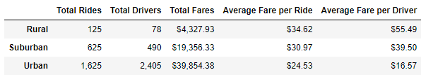

# PyBer_Analysis
---
## Overview
---
Capitalizing on demand for a service is what makes a company thrive. PyBer is a ride-sharing service that operates through an app. PyBer's CEO, V. Isualize, put me in charge of a project to analyze large datasets that linked city types to fare prices and driver availability. Her goal was to understand what areas are being underserved, and how best to adjust PyBer's business strategies.   
## Results
---
I analyzed data collected over 2019, and decided my best starting point was statistical analysis. Please see Table and Figure 1 below.   

  

*Table 1: Breakdown of statistical analysis performed on data collected over the year of 2019.*   

  

*Figure 1: Profit trends of rural, suburban, and urban city types over the first few months of 2019.*   

### Rural   

Rural cities are the most obviously underserved city type in PyBer's service areas. Making up just over 7% of the total rides in a year. However, I found they also have the highest fare rate and least number of drivers of any city type.   

### Suburban   

Suburbs came in second place to urban cities, but still had less than half the number of rides per year as urban cities. Their driver population is roughly 20% of what would be found in urban cities, and average fare rates are almost $6.50 higher.   

### Urban   

Urban cities are where PyBer makes most of its capital. With over 2,000 drivers to serve the area, fare prices remain reasonable. Figure 1 displays the steady business urban cities provide over months.   

## Summary
---

Based on my analysis, I strongly urge PyBer to have at least 10 more drivers within the rural areas, and 20 in the suburbs. Urban areas are holding steady with a strong client base. Increasing the driver counts in the outer cities would result in a decrease in fare rates that would be more reasonable for the average person's wallet. The increase in rides would more than make up for the discounted rates being offered. 

 My second suggestion would be to standardize rates based on mileage and area being served. It's expected for rates to be higher the farther away from urban cities one gets, but currently there's too high of a price disparity. 

 Third and final suggestion would be for drivers to serve a wider area. Urban cities have more drivers than rides according to Table 1's data. Dispersing them out into the other city types would be a quick way to improve driver availability and profits in other regions. 